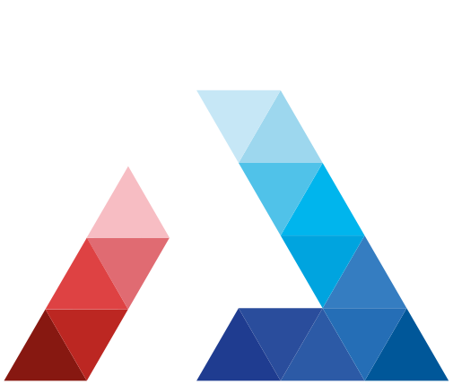

<div id="top"></div>
<br />

<div align="center">
<a href="https://github.com/Inge-Info/MSPR_API">
    
</a>

<h3 align="center">Website</h3>

  <p align="center">
    Website of the Chartreuse Gaming association.
    <br />
    <a href="https://chartreuse-gaming.fr/"><strong>chartreuse-gaming.fr »</strong></a>
  </p>
</div>
<br />

<details>
  <summary>Table of Contents</summary>
  <ol>
    <li>
      <a href="#about-the-project">About The Project</a>
      <ul>
        <li><a href="#features">Features</a></li>
        <li><a href="#tech-stack">Tech Stack</a></li>
        <li><a href="#color-reference">Color Reference</a></li>
      </ul>
    </li>
    <li>
      <a href="#getting-started">Getting Started</a>
      <ul>
        <li><a href="#prerequisites">Prerequisites</a></li>
        <li><a href="#run-locally">Run Locally</a></li>
        <li><a href="#deployment">Deployment</a></li>
      </ul>
    </li>
    <li><a href="#roadmap">Roadmap</a></li>
    <li><a href="#feedback">Feedback</a></li>
    <li><a href="#licence">Licence</a></li>
    <li><a href="#author">Author</a></li>
  </ol>
</details>

## About The Project

Website of the association Chartreuse Gaming presenting the organization as a whole and gathering all the past and
future events organized by it.

### Features

- Home page
- Timeline
- Carousel and galleries
- Rankings
- Presentation of the association
- Presentation of future and past events
- Twitch stream status

### Tech Stack

- [VueJS 3](https://vuejs.org/)
- [Sass](https://sass-lang.com/)
- [Vue-i18n](https://vue-i18n.intlify.dev/)
- [Vue-router](https://router.vuejs.org/)
- [Vue-my-photos](https://github.com/am283721/vue-my-photos)
- [Vue-observe-visibility](https://github.com/Akryum/vue-observe-visibility)
- [Disable-scroll](https://github.com/gilbarbara/disable-scroll#readme)
- [Fontawesome](https://fontawesome.com/)
- [SplideJS](https://splidejs.com/)

### Color Reference

| Color                    | Hex                                                              | Description              |
|--------------------------|------------------------------------------------------------------|--------------------------|
| Text color               |  #ffffff | Titles and subtitles     |
| Subtext Color            |  #e6e6e6 | Texts and description    |
| Footer text Color        |  #b9b9b9 | Footer texts             |
| Green Color              |  #23d940 | Texts, decorations, etc. |
| Green Color (for button) |  #1db036 | Background for buttons   |
| Background Color         |  #262626 | Global background        |

<p align="right">(<a href="#top">back to top</a>)</p>

## Getting Started

### Prerequisites

- Install [NodeJS](https://nodejs.org/) with [npm](https://www.npmjs.com/)

```bash
  curl -fsSL https://deb.nodesource.com/setup_16.x | sudo -E bash -
  sudo apt-get install -y nodejs
```

### Run locally

1. Clone the project

```bash
  git clone https://github.com/Chartreuse-Gaming/website
  cd website
```

2. Install dependencies

```bash
  npm install
```

3. Start the server

```bash
  npm run serve
```

The server should start on [localhost:8080](http://localhost:8080/).

### Deployment

To deploy this project run

```bash
  npm run build
```

A new `dist` folder will appear containing the entire compiled website.

<p align="right">(<a href="#top">back to top</a>)</p>

## Roadmap

- [x] Home page
- [x] Timeline
- [x] Carousel
- [x] Ranking
- [x] Gallery
- [ ] Add all events
- [ ] Twitch API integration
- [ ] Google Drive integration
- [ ] Build with [Astro](https://astro.build/)

<p align="right">(<a href="#top">back to top</a>)</p>

## Feedback

If you have any feedback, please reach out to us at [contact@chartreuse-gaming.fr](mailto:contact@chartreuse-gaming.fr).

<p align="right">(<a href="#top">back to top</a>)</p>

## License

[GPL](https://choosealicense.com/licenses/gpl-3.0/)

<p align="right">(<a href="#top">back to top</a>)</p>

## Author

[@Minarox](https://www.github.com/Minarox)

<p align="right">(<a href="#top">back to top</a>)</p>
